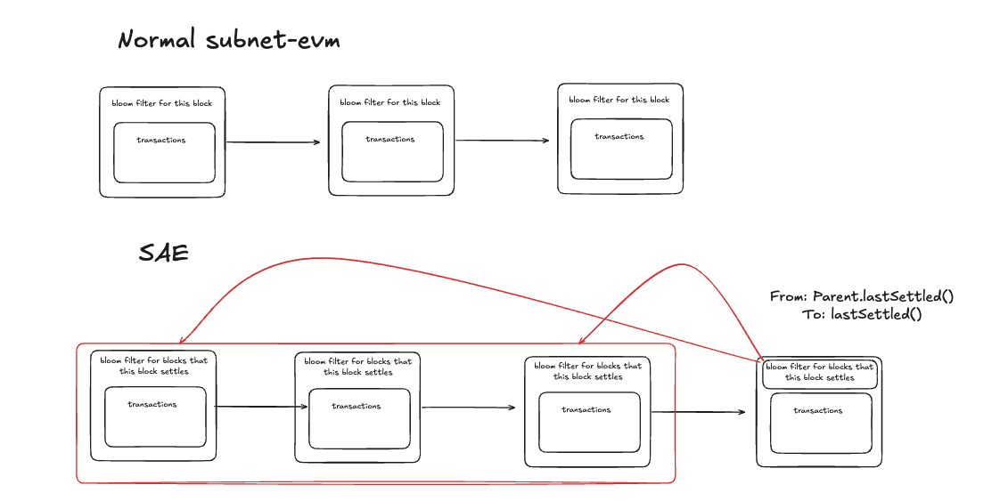

# ICM Relayer Bloom Shortcut vs SAE — Code Analysis

**What:** The ICM relayer's live-path shortcut for detecting warp events in a new block is silently incorrect on Helicon (SAE-enabled) chains. Under classic subnet-evm the shortcut was safe. This document points at the exact code paths and shows precisely where the two chains diverge.

---

## 1. The relayer's assumption

`icm-services/types/types.go:58-66`:

```go
// Check if the block contains warp logs, and fetch them from the client if it does
if header.Bloom.Test(TeleporterPrecompileLogFilter[:]) {
    ...
    logs, err = ethClient.FilterLogs(cctx, ethereum.FilterQuery{
        Topics:    topics,
        FromBlock: header.Number,
        ToBlock:   header.Number,
    })
    ...
}
```

The comment states the assumption: *the block contains warp logs iff its header's `Bloom` test passes for the warp topic.* The relayer trusts `header.Bloom` as a summary of "which log topics were emitted in this block's own transactions."

`header` here is a `*types.Header` from `github.com/ava-labs/libevm/core/types`, delivered to the relayer via `ethclient.SubscribeNewHead` on the destination chain's WebSocket. The relayer's code is at `icm-services/vms/evm/subscriber.go:34,177,200-207`.

The relayer's assumption is a direct consequence of how Ethereum block headers work: the `LogsBloom` field is defined by the yellow paper as the bloom of the receipts of the transactions in that block. Every EVM chain the relayer previously targeted preserved that convention.

---

## 2. Classic subnet-evm — the assumption holds

Block assembly path on classic subnet-evm:

- `graft/subnet-evm/miner/worker.go:501`, the miner executes txs, produces receipts, then calls `w.engine.FinalizeAndAssemble(chain, header, parent, state, txs, nil, receipts)`.
- `graft/subnet-evm/consensus/dummy/consensus.go:331-337` (`FinalizeAndAssemble`):

  ```go
  header.Root = state.IntermediateRoot(chain.Config().IsEIP158(header.Number))
  return types.NewBlock(
      header, txs, uncles, receipts, trie.NewStackTrie(nil),
  ), nil
  ```

  `types.NewBlock(header, txs, uncles, receipts, ...)` internally sets `header.Bloom = types.CreateBloom(receipts)` and `header.ReceiptHash` from the same receipts. This is the go-ethereum standard behaviour.

- Verified on every peer at `graft/subnet-evm/core/block_validator.go:127-131`:

  ```go
  rbloom := types.CreateBloom(receipts)
  if rbloom != header.Bloom {
      return fmt.Errorf("invalid bloom (remote: %x  local: %x)", header.Bloom, rbloom)
  }
  ```

So under classic subnet-evm: **the `header.Bloom` on block N is `CreateBloom(receipts of N)`**, computed at build time and enforced at validation time. The relayer's shortcut is a valid pre-filter — a false negative is cryptographically impossible.

Notification path: `graft/subnet-evm/core/blockchain.go:1235-1242`, `writeCanonicalBlockWithLogs` fires `chainHeadFeed.Send(ChainHeadEvent{Block: block})` after execution and canonical write. WS subscribers get the header with the correct bloom already populated.

---

## 3. Helicon SAE — the assumption breaks

Under ACP-194, block acceptance is decoupled from block execution. The block builder can no longer set `header.Bloom` from "this block's receipts", because at build time this block hasn't been executed yet. Instead, SAE reuses the header field to carry information about the settled predecessor range.


### 3.1 What the ACP-194 spec says

> "already-executed blocks are settled once a following block that includes the results of the executed block is accepted. The results are included by setting the state root to that of the last executed block and the receipt root to that of a MPT of all receipts since last settlement, possibly from more than one block."

Two things to notice:

- The header fields (`Root`, `ReceiptHash`, and by direct consequence `LogsBloom`, which is derived from the same receipts set) reflect the **settled** predecessor(s), not this block.
- The receipts covered can span **more than one block** (whatever range this block newly settles).

### 3.2 SAE block builder

`avalanchego/vms/saevm/sae/block_builder.go:161-227,308-317`:

```go
// determine what this new block will settle
lastSettled, err := lastToSettle(b.hooks, hdr, parent, b.now(), log)
...

// state root is the settled block's post-execution state root, not this block's
hdr.Root = lastSettled.PostExecutionStateRoot()
...

// aggregate receipts across every block newly settled by this block
var receipts types.Receipts
settling := blocks.Range(parent.LastSettled(), lastSettled)
for _, b := range settling {
    receipts = append(receipts, b.Receipts()...)
}
...

ethB, err := builder.BuildBlock(
    hdr,
    bCtx,
    included,
    receipts,       // <-- these are the SETTLED blocks' receipts
    includedOps,
    hook.Settled{
        Height:       lastSettled.NumberU64(),
        ...
    },
)
```

`builder.BuildBlock` internally populates the header's `ReceiptHash` and `LogsBloom` from that `receipts` slice — matching the classic go-ethereum convention shape-wise, but with completely different semantics: **the bloom summarises what this block *settles*, not what this block *contains*.**

### 3.3 The SAE server-side workaround

`avalanchego/vms/saevm/sae/rpc/indexing.go:33-49`:

```go
// A bloomOverrider constructs Bloom filters from persisted receipts instead of
// relying on the [types.Header] field.
type bloomOverrider struct {
    chain Chain
}

var _ filters.BloomOverrider = bloomOverrider{}

// OverrideHeaderBloom returns the Bloom filter of the receipts generated when
// executing the respective block, whereas the [types.Header] carries those
// settled by the block.
func (b bloomOverrider) OverrideHeaderBloom(header *types.Header) types.Bloom {
    return types.CreateBloom(rawdb.ReadRawReceipts(
        b.chain.DB(),
        header.Hash(),
        header.Number.Uint64(),
    ))
}
```

Wired into the eth backend at `avalanchego/vms/saevm/sae/rpc/rpc.go:112` and `avalanchego/vms/saevm/sae/rpc/indexing.go:64,71`. The docstring is unambiguous: **the header field is not this block's bloom**, and any correct filtering must recompute the bloom on demand from receipts in `rawdb`.

The overrider is used server-side by `eth_getLogs` and the eth filter bloombits index. It is **not** applied to what `newHeads` streams to WS subscribers. WS clients receive the raw header, complete with the "settled predecessor" bloom.

---

## 4. Side-by-side

| | Classic subnet-evm | SAE (Helicon) |
|---|---|---|
| `header.Bloom` on block N | `CreateBloom(receipts of N)` | `CreateBloom(receipts of blocks settled by N)` |
| Set at | Build time, in `FinalizeAndAssemble` | Build time, in `sae/block_builder.go` |
| Enforced at | Peer validation (`block_validator.go`) | (Nothing to enforce; header just carries settled data) |
| `newHeads` header carries | Correct per-block bloom | "Settled predecessor" bloom |
| Server-side `eth_getLogs` | Uses `header.Bloom` directly | Uses `bloomOverrider` to recompute from receipts |
| Relayer's `header.Bloom.Test(...)` | Safe pre-filter, false negatives impossible | Silently misses events whenever the settled range is warp-free but this block isn't |

The single-line semantic change: `LogsBloom` went from "summary of this block's own logs" to "summary of the settled predecessor range." Every downstream assumption built on the classic meaning is now incorrect.

---

## 5. Impact on the relayer

Concrete failure modes for a client using `header.Bloom.Test(topic)` on SAE:

- **Silent miss**: block N contains warp events; the blocks N settles happen to be warp-free; `bloomTest:false`; relayer skips `FilterLogs`; events dropped by the live path.
- **Coincidental correctness**: block N contains warp events; the blocks N settles also happen to have warp events; `bloomTest:true`; relayer runs `FilterLogs(from=N, to=N)`; events found and delivered. Purely lucky.
- **Wasted RPC**: block N is warp-free; the blocks N settles have warp events; `bloomTest:true`; relayer runs `FilterLogs(from=N, to=N)`; returns nothing. Harmless.
- **Correct skip**: neither has warp events; `bloomTest:false`; skip. Correct.

The failure is **deterministic given the settlement schedule**, not intermittent, not load-dependent, not per-validator, not fixable by waiting. The only reason messages ever *are* delivered on SAE is (a) coincidental correctness, (b) the catch-up path on startup/reconnect, which uses unconditional `FilterLogs`, or (c) another relayer instance.

---

## 6. Two fix options

### Option A — Always call FilterLogs

Change `types/types.go:58-66` to always invoke `FilterLogs(from=N, to=N)` regardless of `header.Bloom.Test`. Optionally keep the bloom test as an advisory computation for logging.

- Correct on both classic subnet-evm and SAE.
- Cost: one extra `eth_getLogs` per block. Server-side this goes through `bloomOverrider` on SAE and through the header's own bloom bits on classic — both cheap.
- No SAE-specific branching.
- Recommended.

### Option B — Range-aware shortcut

Parse the SAE-specific "last settled" height from the header extra data (populated at `block_builder.go:315-327` via `hook.Settled`), track the previous block's last-settled value, and when `header.Bloom.Test` passes, run `FilterLogs(from=prevLastSettled+1, to=lastSettled)` instead of `FilterLogs(from=N, to=N)`.

- Preserves the shortcut as an optimisation.
- Requires parsing SAE-specific extra data (not part of standard eth-RPC).
- Requires branching between SAE and classic subnet-evm behaviours.
- Only delivers eventual correctness: an unsettled tip stays undelivered until a later block settles it. On a sparse-idle chain this can be a long wait.
- Requires deduplication against the relayer's existing per-block checkpoint.
- Adds real complexity for a marginal RPC saving.

Not recommended unless the extra `eth_getLogs` in Option A turns out to be a measurable cost, which is unlikely on C-Chain-scale traffic.

---

## 7. References

- Relayer bloom shortcut: `icm-services/types/types.go:58-66`
- Relayer WS subscription: `icm-services/vms/evm/subscriber.go:34,177,200-207`
- Classic subnet-evm block assembly: `graft/subnet-evm/consensus/dummy/consensus.go:331-337`
- Classic subnet-evm bloom validation: `graft/subnet-evm/core/block_validator.go:127-131`
- Classic subnet-evm ChainHeadEvent emission (post-execution): `graft/subnet-evm/core/blockchain.go:1235-1242`
- SAE block builder header population: `avalanchego/vms/saevm/sae/block_builder.go:161-227,308-317`
- SAE `bloomOverrider`: `avalanchego/vms/saevm/sae/rpc/indexing.go:33-49`
- SAE overrider wiring into backend: `avalanchego/vms/saevm/sae/rpc/rpc.go:112`, `sae/rpc/indexing.go:64-71`
- SAE invariants and Accepted/Executed/Settled semantics: `avalanchego/vms/saevm/docs/invariants.md`
- ACP-194: https://build.avax.network/docs/acps/194-streaming-asynchronous-execution
