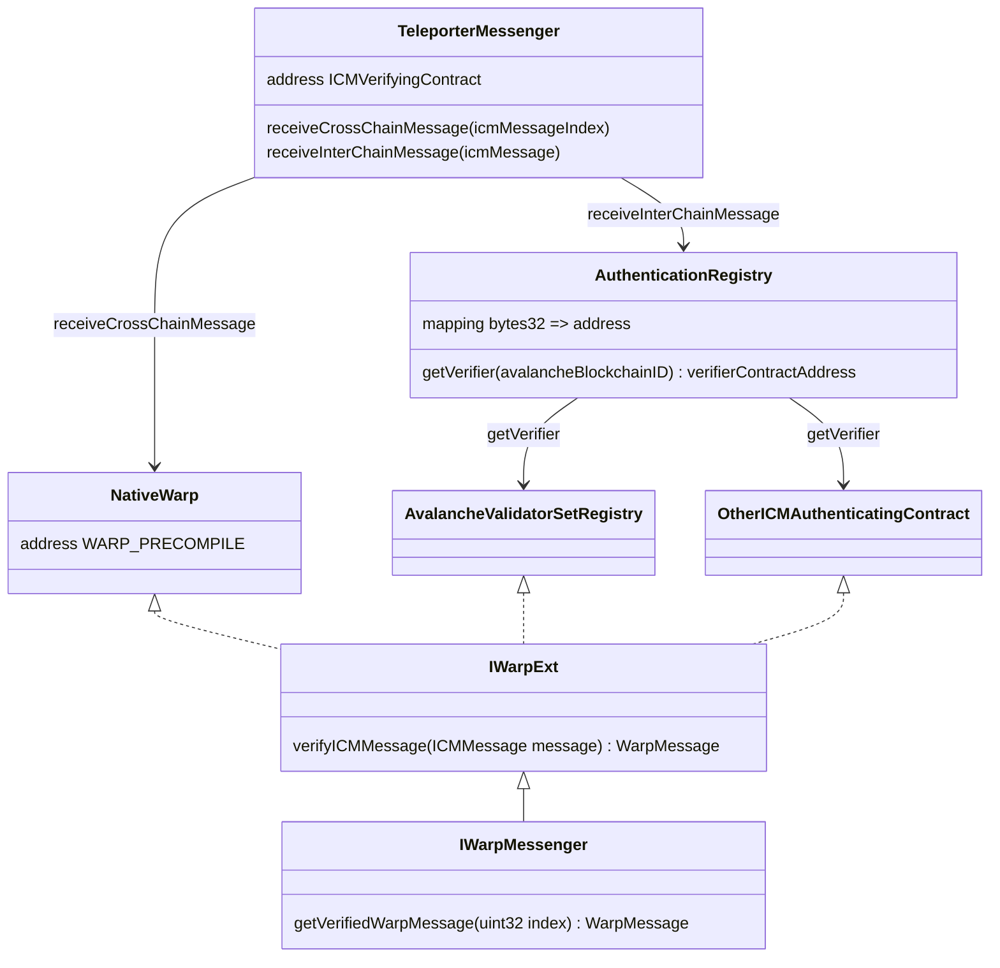

# Teleporter Messenger changes

`Teleporter` is an interoperability messaging primitive that provides at most once delivery of authenticated messages built on top of ICM. We wish to extend this protocol to external EVM chains, but this will require changing the `TeleporterMessenger` contracts which we describe in this section.

This diagram shows the proposed architecture which will be explained below. 



## Accessing Warp / ICM

The messaging primitive that provided authenticated messages between chains for Avalanche L1s was called Warp which was handled by a pre-compiled contract. Warp will be superseded by ICM, but even so, existing Warp contracts cannot work on external EVM chains as is. 

Currently, when `TeleporterMessenger` receives tries to receive an ICM message, it calls the Warp pre-compile (whose  address is hard-coded into the contract), to give it the authenticated message. On external EVM chains, the Warp contract  will not be available as a pre-compile and the address at which it is deployed may not be deterministic. As such, the Warp contract address cannot be hard-coded.

We could pass this address the `TeleportMessenger` contract construct, but we wish to retain the option of deploying `TeleporterMessenger` contract using Nick's method, more on this later. We instead pass the address in via an initialize method.

## Extending Warp

A second issue with the existing Warp contract is that is cannot directly pass the authenticated ICM message to the  `TeleporterMessnger` contract on request. Instead, it returns information about how the `TeleporterMessenger`  contract can retrieve the information from P-chain storage. 

This obviously won't work on external EVM chains, and thus we Warp to pass the authenticated message to the  `TeleporterMessenger` contract directly. Since, we do not wish to change the Warp pre-compile on Avalanche, we  create a new interface, `IWarpExt`, which extends the interface of Warp pre-compile with new methods. A new contract  called `NativeWarp` wraps the Warp pre-compile and implements the `IWarpExt` interface. This allows us to initialize `TeleporterMessenger` contracts to use Warp on Avalanche (with some newly introduced indirection) or a different  contract implementing the`IWarpExt` interface on external EVM chains.

On external EVM chains, the `AvalancheValidatorSetRegistry` contract implements the `IWarpExt` interface and is able  to pass the authenticated ICM message directly to the `TeleporterMessnger` contract. Details on how authentication  is performed can be found in the [Validator Set Registry](validator_set_registry.md) section. However, it is  possible that certain L1s will prefer to use different authentication methods, and so we wish to allow custom  contracts implementing `IWarpExt`.

## Customizable authentication

In order to support different verification schemes on external EVM chains, `TeleporterMessenger` does not call  implementations of `IWarpExt` directly. Rather it calls into an `AuthenticationRegistry` contract with the source blockchain ID. This is used by the `AuthenticationRegistry` to lookup the address of a contract that can authenticate ICM messages for the given chain. The contract must implement the `IWarpExt` interface so that the `AuthenticationRegistry` can verify the ICM message directly and give the result back to the `TeleporterMessenger` contract. 

## Receiving ICM messages

In order for a `TeleporterMessenger` contract to know if the `IWarpExt` interface implementing contract should  provide the full ICM message or an index for fetching it from the P-chain, there are two different methods that  relayers should call when delivering messages.

If the `TeleporterMessenger` contract lives on Avalanche, it can fetch messages from the P-chain. Relayers should  call the `receiveCrossChainMessage` function, which is identical to the current internal interoperability flow. A  new method, `receiveInterChainMessage`, should be called by relayers to `TeleporterMessenger` contracts on external  EVM chains. This allows the `IWarpExt` interface implementer to give the full ICM message to the  `TeleporterMessenger` contract directly. 

The ICM message payload is parsed by the `TeleporterMessenger` contract as an addressed call: 
```solidity
struct AddressedCall {
    bytes sourceAddress;
    bytes payload;
}
```
The `TeleporterMessenger` contracts on Avalanche are all deployed to the same address via Nick's method and require  the `sourceAddress` field to contain this address. The `TeleporterMessenger` contract on an external EVM chain must  also be able to perform this check even if it is not deployed to the same address as its counterparts on Avalanche.  Thus the `AvalancheValidatorSetRegistry` should be initialized with this address, so the check against this address  can be made. Again, this address is publicly verifiable by any party to ensure that the  `AvalancheValidatorSetRegistry`  was deployed correctly. This allows `TeleporterMessenger` contracts to know that  the message was sent by calling another `TeleporterMessenger` contract whose code is known.


## Message IDs

`TeleporterMessenger` contracts issue a unique ID to each message for a few reasons. It helps ensure the at-most-once delivery guarantee. The first part of this is make sure the same message is not received twice. The second is to look up receipts which are used to send an acknowledgement that a message was successfully received back to the sender. This allows senders to apply retry logic.

Both the `receiveCrossChainMessage` and `receiveInterChainMessage` emit an event upon successfully receiving a messaage. This event is described by the following data type:  
```solidity
 event ReceiveCrossChainMessage(
    bytes32 indexed messageID,
    bytes32 indexed sourceBlockchainID,
    address indexed deliverer,
    address rewardRedeemer,
    TeleporterMessage message
);
```
This also returns the message ID which is expected by external tool to match the ID emitted by the corresponding  `SendCrossChainMessage` event emitted by the sending contract.   

This also requires changing how message IDs are computed in `TeleporterMessenger` contracts. It currently is computed as a hash which includes the address obtained from Nick's method. This is used to version message IDs between `TeleporterMessenger` contract versions, but this will be changed to hard-coded version string instead. This way message IDs can be computed identically on external EVM chains and Avalanche L1s.

Currently, message IDs are computed as follows:  
```solidity
function calculateMessageID(
    bytes32 sourceBlockchainID,
    bytes32 destinationBlockchainID,
    uint256 nonce
) public view returns (bytes32) {
    return
        keccak256(abi.encode(address(this), sourceBlockchainID, destinationBlockchainID, nonce));
}
```
The aspect to note is that the hash include `address(this)`. As mentioned previously, all `TeleporterMessenger` contracts are deployed at the same address using Nick's method. As it may not be possible to deploy to this address on external EVM chains, in order to be robust in making sure that message IDs are computed the same on different chains, the address of the contract needs to be removed from the hash. 

By including `address(this)` in the hash, message IDs were versioned by the current contract. In order to maintain this  property, a hard-coded version string will now be included in the `TeleporterMesssenger` contracts which will fed into the hash instead. The version string should change each time a new version of the contracts are deployed that are not intended to be interoperable with the old contracts. 