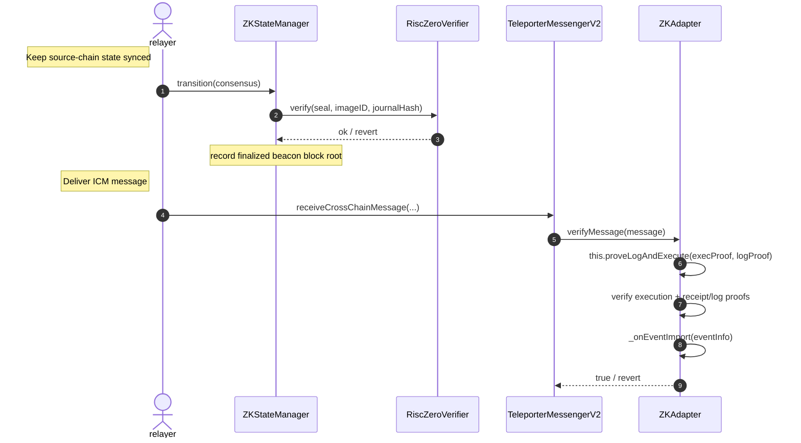

# Verifying ICM Messages with ZK Proofs

As described in [Authenticating ICM Messages](https://github.com/ava-labs/icm-services/blob/main/docs/external-interop/icm_message_authentication.md), any contract that implements the `IMessageVerifier` interface can be used by a `TeleporterMessengerV2` instance to authenticate inbound messages. The protocol is agnostic to how a message is authenticated; that responsibility is delegated entirely to the verifier.

The `ZKAdapter` is one such `IMessageVerifier` implementation. While [`AvalancheValidatorSetRegistry`](https://github.com/ava-labs/icm-services/blob/main/docs/external-interop/origin_avalanche/validator_set_registry.md) authenticates messages originating from Avalanche L1s on an external EVM chain by checking a quorum of BLS validator signatures, the `ZKAdapter` covers the opposite direction: it authenticates messages originating on Ethereum so that they can be consumed on Avalanche L1s. It does so by leveraging zero-knowledge (ZK) proofs of the source chain's consensus rather than trusting a signing committee. From the trusted consensus state, it proves execution-layer events using various Merkle proofs from the beacon state root down to a receipt log event. 
The current supported implementation is [The Signal](https://github.com/boundless-xyz/Signal-Ethereum) by Boundless, an open-source ZK consensus client that compresses Ethereum's finalized beacon-chain checkpoints into a single ZK proof that any chain or contract can verify directly, with the proof carried in the message's attestation and checked on-chain via a RISC Zero deployed verifier.

In short, `ZKAdapter` lets an Avalanche chain trustlessly confirm that a given log/event was emitted on Ethereum, and treats that proven event as the attestation for an ICM message.

## Architecture

`ZKAdapter` is composed of two layers:

* **`ZKStateManager`** — a ZK light client that tracks the finalized beacon-chain state of a single source chain and can prove that a specific execution-layer log was emitted on that chain.
* **`ZKAdapter`** — a wrapper that inherits `ZKStateManager`, implements `IAdapter` (`IMessageSender` and `IMessageVerifier`) adapting the message-emitting and log-proving entry points to the TeleporterV2 format.
```solidity
contract ZKAdapter is ZKStateManager, IAdapter { ... }
```

Because it only implements `IMessageVerifier` (not `IMessageSender`), `ZKAdapter` covers the receiving half of a connection. A full `IAdapter` deployment that needs to both send and receive over this scheme would pair it with a corresponding `IMessageSender` implementation; see the [Teleporter architecture](teleporter_contracts.md) for how a `TeleporterMessengerV2` is bound to an adapter.

## The `ZKStateManager`

The `ZKStateManager` maintains a trusted view of the source chain's beacon chain. It is initialized in its constructor with:

* `sourceChainId` — the chain whose state it tracks,
* `startingState` — the initial `Consensus.State` used as the root of trust,
* `beaconConfig` — the `Execution.BeaconConfig` used to verify execution-layer data,
* `verifier` / `imageID` — the RISC Zero verifier contract and the program image ID of the consensus-transition circuit (the "Signal Ethereum" program),
* `permissibleTimespan` — a bound used to reject stale transitions,
* `admin` / `superAdmin` — role holders for the privileged functions below.

It exposes two core flows.

### 1. Advancing consensus state — `transition`

```solidity
function transition(ConsensusData calldata consensus) external;
```

`transition` advances the tracked beacon state from the contract's current state to a new finalized checkpoint. It:

1. Decodes the `Journal` (pre-state, post-state, finalized slot) from `consensus.journalData`.
2. Verifies the supplied RISC Zero proof (`consensus.seal`) against `imageID` and the journal hash, after first checking that `journal.preState` matches the contract's stored `_currentState` and that the transition is within `permissibleTimespan`. A successful proof attests that `journal.postState` follows from `journal.preState` under Ethereum's Casper FFG consensus rules.
3. Updates `_currentState` to the post-state and records the finalized beacon block root for the finalized slot in the `_allowedBeaconBlocks` mapping (`slot => beaconBlockRoot`).

Each successful `transition` therefore extends the set of finalized beacon block roots the contract considers trustworthy. These roots are the anchors that later log proofs are checked against.

### 2. Proving a log — `proveLogAndExecute`

```solidity
function proveLogAndExecute(
    Execution.Proof calldata execProof,
    Receipt.Proof calldata logProof
) external;
```

This is the entry point that proves a specific event occurred on the source chain. It performs two verifications:

1. **Execution verification.** It looks up the trusted beacon block root for `execProof.anchorSlot` in `_allowedBeaconBlocks` (reverting if that slot has not been confirmed). Then, it calls `Execution.verify` to link the claimed `targetReceiptsRoot` back to that anchor root, traversing the beacon to execution layer via Merkle inclusion proofs. 
2. **Log verification.** It calls `Receipt.verifyAndExtractLog` against the now verified `targetReceiptsRoot` to prove inclusion of the receipt and its log, returning the raw `logData`.

On success it emits `ZKEventImported` and hands the verified event to the internal `_onEventImport` handler:

```solidity
struct ZKEventInfo {
    uint256 sourceChainId;
    uint256 beaconSlot;
    bytes32 executionRoot;
    uint256 logIndex;
    bytes logData;
}
```

Because step 1 requires the anchor slot's beacon root to already be present, **`proveLogAndExecute` can only succeed after the relevant finalized state has been synced via `transition`.** 
Keeping the state manager current is an operational responsibility of the Relayer. 

### Administrative functions

`ZKStateManager` also exposes role-gated maintenance functions: `updateImageID`, `updateVerifier`, and `updatePermissibleTimespan` (all `ADMIN_ROLE`), plus `manualTransition`, which applies a state transition *without* proof verification for emergency recovery. `getBeaconBlockRoot` is a public view helper for inspecting confirmed roots.

## The `ZKAdapter`

`ZKAdapter` adapts `proveLogAndExecute` to the [`IAdapter`](https://github.com/ava-labs/icm-services/blob/ce65f3bd2eb873891fe37026f0d2fb5c98bfe71a/icm-contracts/common/ITeleporterMessengerV2.sol#L38) interface so it can be plugged into a `TeleporterMessengerV2`.

### Attestation format

The `attestation` field of the `TeleporterICMMessage`, a generic `bytes` blob, which must ABI-encode the following struct:

```solidity
struct Attestation {
    Execution.Proof execProof;
    Receipt.Proof logProof;
}
```

These are exactly the two proofs `proveLogAndExecute` consumes: the execution proof anchoring a receipts root to a trusted beacon block, and the log proof establishing the specific log within that receipts root.

### `verifyMessage`

```solidity
function verifyMessage(
    TeleporterICMMessage calldata message
) external returns (bool) {
    Attestation memory att = abi.decode(message.attestation, (Attestation));
    this.proveLogAndExecute(att.execProof, att.logProof);
    return true;
}
```

The flow is:

1. Decode `message.attestation` into an `Attestation`.
2. Call `proveLogAndExecute` with the two proofs, which checks that the log was emitted on the source chain against a finalized beacon block root.

If any part of verification fails, i.e., the anchor slot is unconfirmed, the execution proof does not chain to the trusted root, or the log proof does not check out then `proveLogAndExecute` reverts and that revert propagates out of `verifyMessage`. 

## Verification flow



## Notes and open considerations

* **State must be synced first.** A message cannot be verified until `transition` has confirmed the beacon block root for the relevant `anchorSlot`. The relayer needs to advance `ZKStateManager` ahead of (or alongside) delivering messages that depend on those slots.
* **Verifier-only.** `ZKAdapter` implements just `IMessageVerifier`. Sending messages over this scheme requires a separate `IMessageSender`/`IAdapter` deployment.
* **Coupling of verification and application logic.** `proveLogAndExecute` both verifies the proof *and* fires `_onEventImport` (and emits `ZKEventImported`). Verification therefore has the side effect of running application logic; implementers should keep this in mind, particularly regarding re-entrancy and idempotency.
* **Binding the proven log to the message.** As written, `verifyMessage` proves that *some* log was emitted on the source chain, but it does not check that the proven `logData` actually corresponds to the `message` being verified. That linkage — confirming the verified event matches the ICM message's contents (and is consumed at most once) — needs to be implemented, most naturally inside `_onEventImport`. Without it, a valid proof of an unrelated source-chain event would still cause `verifyMessage` to return `true`.
