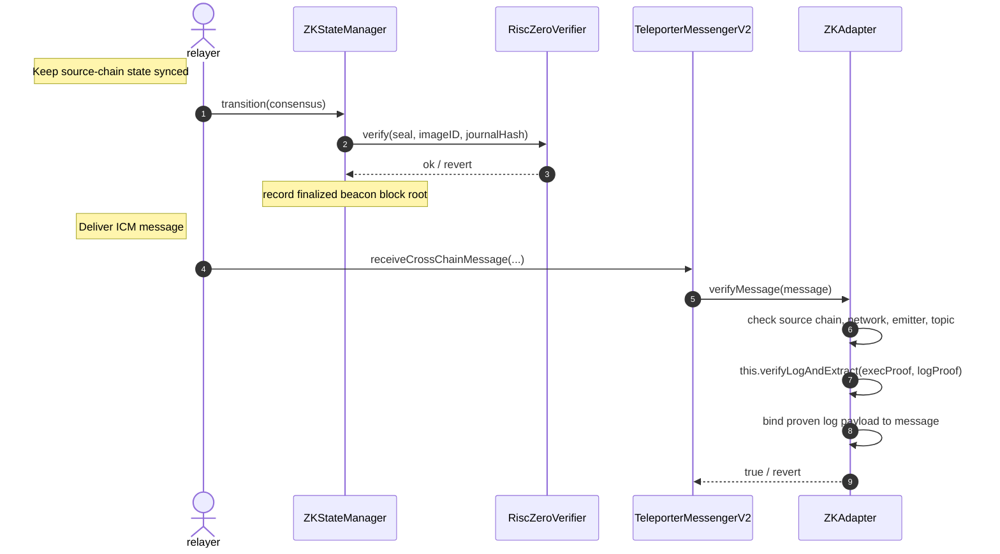

# Verifying ICM Messages with ZK Proofs

As described in [Authenticating ICM Messages](https://github.com/ava-labs/icm-services/blob/main/docs/external-interop/icm_message_authentication.md), any contract that implements the `IMessageVerifier` interface can be used by a `TeleporterMessengerV2` instance to authenticate inbound messages. The protocol is agnostic to how a message is authenticated as that responsibility is delegated entirely to the verifier.

The `ZKAdapter` is one such `IMessageVerifier` implementation. While [`AvalancheValidatorSetRegistry`](https://github.com/ava-labs/icm-services/blob/main/docs/external-interop/origin_avalanche/validator_set_registry.md) authenticates messages originating from Avalanche L1s on an external EVM chain by checking a quorum of BLS validator signatures, the `ZKAdapter` covers the opposite direction: it authenticates messages originating on Ethereum so that they can be consumed on Avalanche L1s. It does so by leveraging zero-knowledge (ZK) proofs of the source chain's consensus rather than trusting a signing committee. From the trusted consensus state, it proves execution-layer events using various Merkle proofs from the beacon state root down to a receipt log event.

The current supported implementation is [The Signal](https://github.com/boundless-xyz/Signal-Ethereum) by Boundless, an open-source ZK consensus client that compresses Ethereum's finalized beacon-chain checkpoints into a single ZK proof that any chain or contract can verify directly, with the proof carried in the message's attestation and checked on-chain via a RISC Zero deployed verifier.

In short, `ZKAdapter` lets an Avalanche chain trustlessly confirm that a given log/event was emitted on Ethereum, and treats that proven event as the attestation for an ICM message.

## Background: Ethereum beacon-chain terms

A few Ethereum consensus-layer concepts are used throughout this document:

* **Slot** — Ethereum's consensus layer, the "beacon chain", advances in fixed time intervals called slots. Each slot may contain one beacon block.
* **Finalized checkpoint** — periodically, validators *finalize* a checkpoint: a slot that the chain commits to irreversibly under Casper FFG. A finalized checkpoint is identified by its epoch and the beacon block root at that boundary.
* **Beacon state root** — each beacon block commits to a Merkle root over the entire consensus state (the "beacon state"). Through that state it also commits to the **execution state** which contains the transactions, receipts, and logs of the corresponding EVM block.

Because all of this is Merkle-committed, a single trusted beacon block root is enough to prove, via inclusion proofs, that a specific execution-layer log was emitted. That is exactly what this adapter does: it trusts a set of finalized beacon roots, established by ZK proof, and then proves individual logs against them.

## Architecture

`ZKAdapter` is composed of two layers:

* **`ZKStateManager`** — a ZK light client that tracks the finalized beacon-chain state of a single source chain and can prove that a specific execution-layer log was emitted on that chain.
* **`ZKAdapter`** — a wrapper that inherits `ZKStateManager` and implements the full [`IAdapter`](https://github.com/ava-labs/icm-services/blob/main/icm-contracts/common/ITeleporterMessengerV2.sol) interface, which implements`IMessageSender` and `IMessageVerifier`, adapting the message-emitting and log-proving entry points to the TeleporterV2 format.

```solidity
contract ZKAdapter is ZKStateManager, IAdapter { ... }
```

Because `ZKAdapter` implements the full `IAdapter`, the same contract can serve both halves of a connection: `sendMessage` originates a message on the source chain by emitting it as a log, and `verifyMessage` authenticates an inbound message on the destination chain by proving that log. For the Ethereum to Avalanche direction, an instance is deployed on each side at the same address (via Nick's method); the source-side instance emits, and the destination-side instance verifies. See the [Teleporter architecture](https://github.com/ava-labs/icm-services/blob/main/docs/external-interop/teleporter_contracts.md) for how a `TeleporterMessengerV2` is bound to an adapter.

## `ZKStateManager`

The `ZKStateManager` maintains a trusted view of the source chain's beacon chain. It is initialized in its constructor with:

* `sourceChainId` — the chain whose state it tracks,
* `startingState` — the initial `Consensus.State` used as the root of trust,
* `beaconConfig` — the `Execution.BeaconConfig` used to verify execution-layer data,
* `verifier` / `imageID` — the RISC Zero verifier contract and the program image ID of the consensus-transition circuit (the "Signal Ethereum" program),
* `permissibleTimespan` — a bound used to reject stale transitions,
* `admin` / `superAdmin` — role holders for the privileged functions below.

The root of trust is a `Consensus.State`: a pair of checkpoints (the latest justified and the latest finalized), each identified by an epoch and a beacon block root.

```solidity
library Consensus {
    struct Checkpoint {
        uint64 epoch;
        bytes32 root; // beacon block root for the epoch boundary block
    }
    struct State {
        Checkpoint currentJustifiedCheckpoint;
        Checkpoint finalizedCheckpoint;
    }
}
```

Internally, the manager keeps two pieces of contract state that the flows below read and write:

* `_currentState` — a `Consensus.State`; the single, latest trusted consensus state. Each transition overwrites it.
* `_allowedBeaconBlocks` — a state mapping `slot => beaconBlockRoot` that accumulates every finalized beacon block root the contract has confirmed. Entries are added and never overwritten, so it grows into the full set of trusted anchors.

It exposes two core flows.

### 1. Advancing consensus state — `transition`

```solidity
function transition(ConsensusData calldata consensus) external;

struct ConsensusData {
    bytes journalData;    // ABI-encoded Journal (the proof's public inputs)
    bytes seal;           // the RISC Zero ZK proof
    uint64 finalizedSlot; // slot of the newly finalized checkpoint
}

struct Journal {
    Consensus.State preState;  // must match the contract's stored _currentState
    Consensus.State postState; // the resulting state after the transition
    uint64 finalizedSlot;
}
```

`transition` advances the tracked beacon state from the contract's current state to a new finalized checkpoint. It:

1. Decodes the `Journal` (pre-state, post-state, finalized slot) from `consensus.journalData`.
2. Verifies the supplied RISC Zero proof (`consensus.seal`) against `imageID` and the journal hash, after first checking that `journal.preState` matches the contract's stored `_currentState` and that the transition is within `permissibleTimespan`. A successful proof attests that `journal.postState` follows from `journal.preState` under Ethereum's Casper FFG consensus rules.
3. Updates the contract's `_currentState` to the post-state and records the finalized beacon block root for the finalized slot in `_allowedBeaconBlocks`.

Each successful `transition` therefore extends the set of finalized beacon block roots the contract considers trustworthy. These roots are the anchors that later log proofs are checked against.

### 2. Proving a log — `verifyLogAndExtract`

```solidity
function verifyLogAndExtract(
    Execution.Proof calldata execProof,
    Receipt.Proof calldata logProof
) external returns (bytes memory logData);
```

The two proof structs it consumes trace a chain of trust from a beacon block root down to a single log. `Execution.Proof` links a receipts root back to a trusted beacon block root:

```solidity
struct Proof {
    uint64 anchorSlot;                    // slot whose trusted beacon root anchors the proof
    uint64 targetSlot;                    // slot where the target transaction occurred
    bytes32 anchorBeaconStateRoot;        // trusted block -> anchor beacon state
    bytes32[] anchorBeaconStateProof;
    bytes32 targetBeaconStateRoot;        // anchor state -> target beacon state (history)
    bytes32[] targetBeaconStateProof;
    bytes32 targetExecutionHeaderRoot;    // target state -> execution header
    bytes32[] targetExecutionHeaderProof;
    bytes32 targetReceiptsRoot;           // execution header -> receipts root
    bytes32[] targetReceiptsProof;
}
```

`Receipt.Proof` proves a specific log lives inside that receipts root:

```solidity
struct Proof {
    bytes[] proof;            // Merkle-Patricia inclusion proof (RLP-encoded trie nodes)
    bytes key;               // RLP-encoded transaction index
    bytes value;             // RLP-encoded receipt
    uint256 logIndex;        // which log in the receipt
    address expectedEmitter; // contract that must have emitted the log
    bytes32 expectedTopic0;  // event signature the log must match
}
```

This is the entry point that proves a specific log was emitted on the source chain. It performs two verifications:

1. **Execution verification.** It looks up the trusted beacon block root for `execProof.anchorSlot` in the `_allowedBeaconBlocks` state mapping (reverting if that slot has not been confirmed). It then calls `Execution.verify` to link the claimed `targetReceiptsRoot` back to that anchor root, traversing from the beacon layer to the execution layer via Merkle inclusion proofs.
2. **Log verification.** It calls `Receipt.verifyAndExtractLog` against the now-verified `targetReceiptsRoot` to prove inclusion of the receipt and its log, and returns the raw, non-indexed `logData`.

On success it emits `ZKEventImported` and returns `logData` to the caller; the caller is responsible for decoding and interpreting that data.

Because step 1 requires the anchor slot's beacon root to already be present in `_allowedBeaconBlocks`, **`verifyLogAndExtract` can only succeed after the relevant finalized state has been synced via `transition`.** Keeping the state manager current is an operational responsibility of the relayer.

### Administrative functions

`ZKStateManager` also exposes role-gated maintenance functions: `updateImageID`, `updateVerifier`, and `updatePermissibleTimespan` (all `ADMIN_ROLE`), plus `manualTransition`, which applies a state transition *without* proof verification for emergency recovery. `getBeaconBlockRoot` is a public view helper for inspecting confirmed roots.

## `ZKAdapter`

`ZKAdapter` adapts the `ZKStateManager` flows to the `IAdapter` interface so it can be plugged into a `TeleporterMessengerV2`.

### `sendMessage`

```solidity
function sendMessage(TeleporterMessageV2 calldata message) external {
    require(msg.sender == message.originTeleporterAddress, "unauthorized sender");
    emit TeleporterV2MessageSent(abi.encode(message));
}
```

On the source chain, `sendMessage` originates a message by emitting it as a `TeleporterV2MessageSent` log that the relayer later proves on the destination chain. The `require` enforces that the caller is the originating Teleporter messenger: the messenger sets `originTeleporterAddress` to its own address (`address(this)`) before calling the adapter, so this check guarantees only the genuine messenger can emit a message. Without it, anyone could call `sendMessage` directly with an attacker-authored message and produce a log that the destination side would accept.

### Attestation format

The `attestation` field of the `TeleporterICMMessage` is a generic `bytes` blob that must ABI-encode the following struct:

```solidity
struct Attestation {
    Execution.Proof execProof;
    Receipt.Proof logProof;
}
```

These are exactly the two proofs `verifyLogAndExtract` consumes: the execution proof anchoring a receipts root to a trusted beacon block, and the log proof establishing the specific log within that receipts root.

### `verifyMessage`

```solidity
function verifyMessage(
    TeleporterICMMessage calldata message
) external returns (bool) {
    Attestation memory att = abi.decode(message.attestation, (Attestation));
    require(message.sourceBlockchainID == bytes32(sourceChainId), "bad source chain");
    require(message.sourceNetworkID == sourceNetworkId, "bad network");

    require(att.logProof.expectedEmitter == address(this), "bad emitter");
    require(att.logProof.expectedTopic0 == _MESSAGE_SENT_TOPIC, "bad topic");

    bytes memory logData = this.verifyLogAndExtract(att.execProof, att.logProof);
    bytes memory emitted = abi.decode(logData, (bytes));
    require(keccak256(emitted) == keccak256(abi.encode(message.message)), "payload mismatch");

    return true;
}
```

`verifyMessage` confirms the message really came from the source chain and isn't something the relayer made up. The relayer supplies the proof, so the adapter can't trust the fields in it; instead it checks each one against a value it already knows. It confirms the message names the chain and network this adapter tracks, that the proven log was emitted by the trusted adapter (the same contract address on both chains, via Nick's method), and that the log is a `TeleporterV2MessageSent` event. It then runs `verifyLogAndExtract` to check the proof against the synced beacon state. Finally, it checks that the log's contents match the message being verified — the step that ties the proof to *this* message, since otherwise a real proof of some unrelated event would pass. If any check fails the call reverts, and that revert propagates out of `receiveCrossChainMessage`.

## Verification flow


