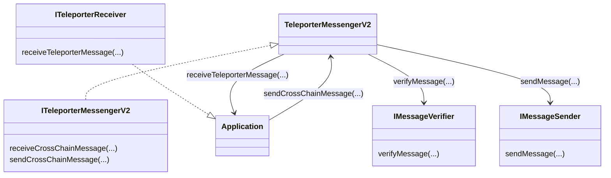
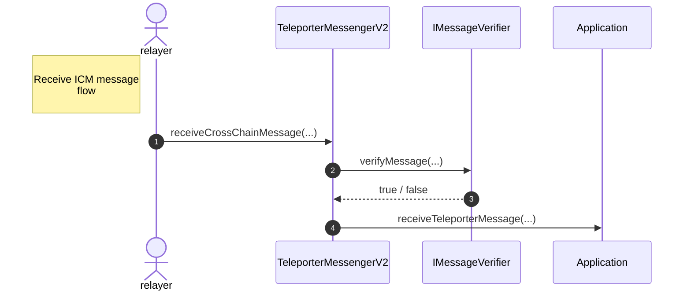
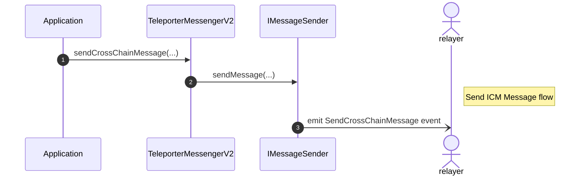

Teleporter is a protocol of interoperability messaging primitives that provides at most one delivery of authenticated ICM messages.  For interoperability between Avalanche L1s and a description of the actual protocol, see [here](../../icm-contracts/contracts/teleporter/README.md). We wish to extend this protocol to external EVM chains, but we cannot use the current contract (`ITeleporterMessenger`). Here we describe the new contracts we will need and the overall architecture.

## Decoupling message passing from Teleporter

 The new `TeleporterMessengerV2` contract will implement a new `ITeleporterMessengerV2` interface. The `TeleporterMessengerV2` contract should not concern itself with how messages are sent or authenticated. This will depend on the two chains being connected and will be handled by other contracts. Instead, its job is to ensure at most once delivery of messages and to provide the API on which further protocols (such as `ICTT`) are built.

This differs from the `TeleporterMessenger` contracts which had direct access to a pre-compile contract called `Warp`which provides it with the means of retrieving and authenticating messages.  Instead, the `TeleporterMessengerV2` contract will need access to a pair of contract addresses that each implement one of the two new interfaces:  `IMessageVerifier` and `IMessageSender`. This allows a `TeleporterMessengerV2` contract living on a specific blockchain to be configured to handle interfacing with a specific counter-party blockchain in a generic way.

```solidity
struct TeleporterMessageV2 {
    uint256 messageNonce;
    address originSenderAddress;
    address originTeleporterAddress;
    bytes32 destinationBlockchainID;
    address destinationAddress;
    uint256 requiredGasLimit;
    address[] allowedRelayerAddresses;
    bytes message;
}

// A domain type for the specific kind of ICM message TeleporterMessengerV2 expects
struct TeleporterICMMessage {
    TeleporterMessageV2 message;
    uint32 sourceNetworkID;
    bytes32 sourceBlockchainID;
    // Arbitrary bytes that is used by receiving contracts to
    // authenticate this message.
    bytes attestation;
}

struct TeleporterMessage {
    uint256 messageNonce;
    address originSenderAddress;
    address originTeleporterAddress;
    bytes32 destinationBlockchainID;
    address destinationAddress;
    // This field may not be necessary depending on the finalized design.
    address verifierAddress;
    uint256 requiredGasLimit;
    address[] allowedRelayerAddresses;
    TeleporterMessageReceipt[] receipts;
    bytes message;
}

interface IMessageVerifier {
    function verifyMessage(
        TeleporterICMMessage calldata message
    ) external returns (bool);
}

interface IMessageSender {
    /**
    * @notice This function emits the correct type of event to be
    * consumed by a relayer. 
    */
    function sendMessage(TeleporterMessageV2 calldata message) external;
}

interface IAdapter is IMessageSender, IMessageVerifier {}
```

Note the attestation field of the `TeleporterICMMessage` is a generic blob of bytes, giving it flexibility to be a BLS signature, a certificate for CCIP, a tuple including a ZK proof, state root, Merkle path to an event for a Boundless ZK Proof, or something entirely different.

This design maintains interface compatibility with applications already built on top of the Teleporter protocol. The architecture looks as follows.


```mermaid
classDiagram
  TeleporterMessengerV2 <|..	ITeleporterMessengerV2
	ITeleporterReceiver..|> Application
	ITeleporterReceiver: receiveTeleporterMessage(...)
	ITeleporterMessengerV2: receiveCrossChainMessage(...)
	ITeleporterMessengerV2: sendCrossChainMessage(...)
	Application-->TeleporterMessengerV2: sendCrossChainMessage(...)
	TeleporterMessengerV2-->Application: receiveTeleporterMessage(...)
	TeleporterMessengerV2-->IMessageVerifier: verifyMessage(...)
	TeleporterMessengerV2-->IMessageSender: sendMessage(...)
	IMessageVerifier: verifyMessage(...)
	IMessageSender: sendMessage(...)
```


```mermaid
sequenceDiagram
autonumber
actor relayer
note left of relayer:<br> Receive ICM message <br>flow<br>
relayer->>TeleporterMessengerV2: receiveCrossChainMessage(...)
TeleporterMessengerV2->>IMessageVerifier: verifyMessage(...)
IMessageVerifier-->>TeleporterMessengerV2: true / false
TeleporterMessengerV2->>Application: receiveTeleporterMessage(...)
```


```mermaid
sequenceDiagram
autonumber
Application->>TeleporterMessengerV2: sendCrossChainMessage(...)
TeleporterMessengerV2->>IMessageSender: sendMessage(...)
actor relayer
note right of relayer: Send ICM Message flow
IMessageSender-) relayer: emit SendCrossChainMessage event
```

How a `TeleporterMessengerV2` contract decides which `IMessageVerifier` is detailed [here](icm_message_authentication.md). It is up to applications to understand how this works and to decide the verification scheme they require for receiving messages.

## Message IDs

The `Teleporter` protocol issues a unique ID to each message to help ensure at-most-once delivery. It is used to make sure a message is not received twice as well as to store receipts of received messages. Relayers can send these receipts back to the sending application to communicate successful delivery of a message. It also ties messages to a specific `Teleporter` version.

Given two blockchains and a pair of `TeleporterMessengerV2` contracts each chain has access to, we can talk about a _connection_ between two chains (naturally there may be many such connections each defining their own security model). Message IDs should be unique to each connection and contain nonces to distinguish messages along a given connection. They are a hash of several pieces of information pertaining to the message:

- The source blockchain ID
- The destination blockchain ID
- A nonce (unique per source blockchain)
- The source / destination `TeleporterMessengerV2` contract’s address (these will be the same as they will deployed via Nick's method)