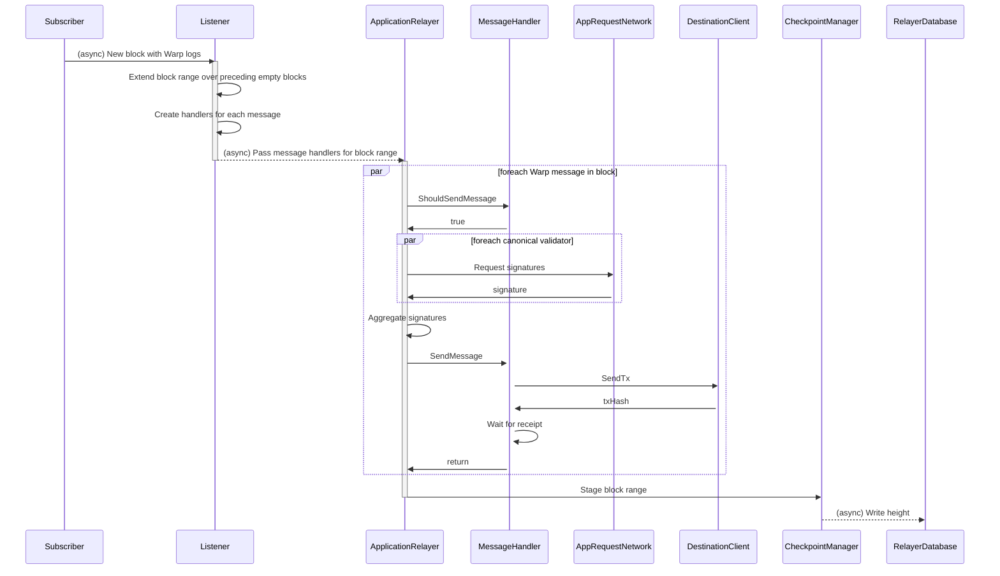

# Processing the Warp messages in a new block
Illustration of the sequence of events triggered by a new block containing Warp messages to relay. The Subscriber is only notified of blocks that contain logs matching the listener's message protocol; the blocks in between, which contain no messages, are checkpointed together with the next block that does.
